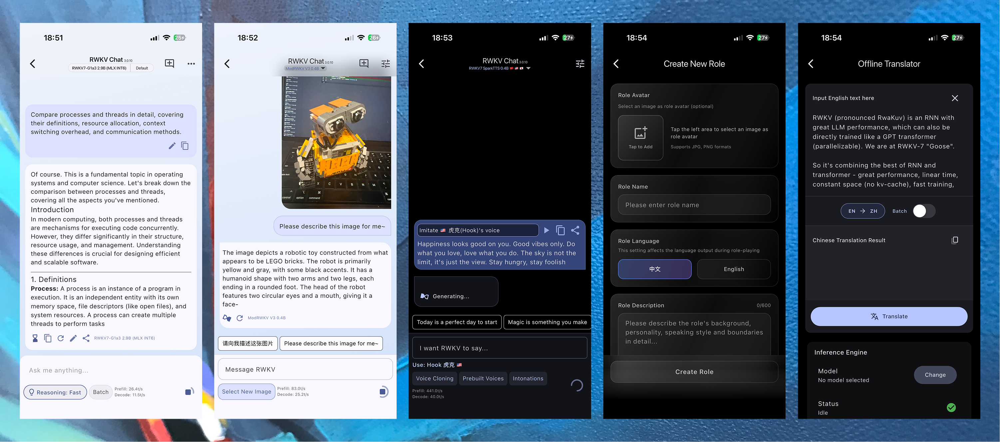

# RWKV App ✨

[](LICENSE)
[](./README.md)
[](./README.zh-hans.md)
[](./README.zh-hant.md)
[](./README.ja.md)
[](./README.ko.md)
[](./README.ru.md)

**通过 RWKV App，探索、体验在端侧设备上离线运行大语言模型**
**面向日常设备的隐私优先、完全端侧的 LLM 体验。**

RWKV Apps 是一款实验性的应用程序，它将大语言模型（LLM）直接带到您的 Android / iOS 设备上。您可以尽情试验不同的模型、进行聊天、生成语音、视觉理解等等！所有计算都在本地进行，加载模型后无需网络连接。

**概述**

RWKV App 支持多轮对话、文本转语音、视觉理解等多种任务。



## ✨ 核心功能

- **📱 本地运行，完全离线：** 无需互联网连接，即可体验生成式 AI 的魅力。所有计算都直接在您的设备上完成。
- **🤖 随心切换模型：** 从 Hugging Face 轻松下载并切换不同的模型，比较它们的性能。
- **💬 AI 聊天：** 进行流畅的多轮对话。
- **🔊 文本转语音 (TTS)：** 将文本转换成自然流畅的语音。
- **🖼️ 视觉理解：** 探索基于图像的 AI 应用场景。
- **🌓 深色模式：** 支持在不同光线环境下舒适使用。

## 🧭 下载与体验

### 下载

**官方下载页面：[https://rwkv.halowang.cloud/](https://rwkv.halowang.cloud/)**

<table>
<thead>
<tr>
<th style="text-align: center;"></th>
<th style="text-align: center;">RWKV Chat</th>
<th style="text-align: center;">RWKV Sudoku</th>
<th style="text-align: center;">RWKV Othello</th>
</tr>
</thead>
<tbody>
<tr>
<td style="text-align: center;">Android APK 下载链接</td>
<td style="text-align: center;"><a href="https://play.google.com/store/apps/details?id=com.rwkvzone.chat">Google Play</a> / <a href="https://github.com/RWKV-APP/RWKV_APP/releases">GitHub Release</a> / <a href="https://huggingface.co/datasets/HaloWang/rwkv-chat/tree/main/android-arm64">huggingface</a> / <a href="https://www.pgyer.com/rwkvchat">蒲公英</a></td>
<td style="text-align: center;"><a href="https://huggingface.co/datasets/rwkv-app/RWKV-Sudoku/tree/main">huggingface</a> / <a href="https://www.pgyer.com/rwkv-sudoku">蒲公英</a></td>
<td style="text-align: center;"><a href="https://huggingface.co/datasets/rwkv-app/RWKV-Othello/tree/main">huggingface</a> / <a href="https://www.pgyer.com/rwkv-othello">蒲公英</a></td>
</tr>
<tr>
<td style="text-align: center;">iOS</td>
<td style="text-align: center;"><a href="https://apps.apple.com/us/app/rwkv-chat/id6740192639">App Store</a> / <a href="https://testflight.apple.com/join/DaMqCNKh">testflight</a></td>
<td style="text-align: center;">-</td>
<td style="text-align: center;"><a href="https://testflight.apple.com/join/f5SVf76c">testflight</a></td>
</tr>
<tr>
<td style="text-align: center;" rowspan="2">Windows</td>
<td style="text-align: center;" colspan="3" rowspan="2"><a href="https://github.com/RWKV-APP/RWKV_APP/releases">GitHub Release</a> / <a href="https://huggingface.co/datasets/HaloWang/rwkv-chat/tree/main/windows-x64">huggingface (zip)</a> / <a href="https://huggingface.co/datasets/HaloWang/rwkv-chat/tree/main/windows-x64-installer">huggingface (installer)</a> / <a href="https://qm.qq.com/q/y0gOHcguty">QQ 群</a> / <a href="https://discord.gg/8NvyXcAP5W">Discord</a></td>
</tr>
<tr></tr>
<tr>
<td style="text-align: center;" rowspan="2">macOS</td>
<td style="text-align: center;" colspan="3" rowspan="2"><a href="https://github.com/RWKV-APP/RWKV_APP/releases">GitHub Release</a> / <a href="https://huggingface.co/datasets/HaloWang/rwkv-chat/tree/main/macos-universal">huggingface</a> / <a href="https://qm.qq.com/q/y0gOHcguty">QQ 群</a> / <a href="https://discord.gg/8NvyXcAP5W">Discord</a></td>
</tr>
<tr></tr>
<tr>
<td style="text-align: center;">Linux</td>
<td style="text-align: center;"><a href="https://github.com/RWKV-APP/RWKV_APP/releases">GitHub Release</a> / <a href="https://huggingface.co/datasets/HaloWang/rwkv-chat/tree/main/linux-x64">huggingface</a></td>
<td style="text-align: center;">-</td>
<td style="text-align: center;">-</td>
</tr>
</tbody>
</table>

> [!NOTE]
> 未来，我们会将所有独立功能整合进 RWKV Chat 应用中，为您提供统一的体验。

### 使用

首次打开 App 时，会弹出模型选择面板。请根据您的需求选择要使用的模型权重。

> [!WARNING]
> iPhone 14 及更早的设备可能无法流畅运行 1.5B / 2.9B 参数规模的模型。

## 💻 开发

**请确保您已搭建好 [Flutter](https://flutter.dev/) 开发环境。**

1. **克隆仓库：**

```bash
# 必须切换到 'dev' 分支
git clone -b dev https://github.com/MollySophia/rwkv_mobile_flutter.git
# 确保 rwkv_mobile_flutter 和 RWKV_APP 在同一目录下
git clone -b dev https://github.com/RWKV-APP/RWKV_APP.git
cd RWKV_APP
```

2. **创建必要的配置文件：**

```bash
touch assets/filter.txt;touch .env;
```

3. **安装依赖：**

```bash
flutter pub get
```

4. **（可选）为 `tools` 目录安装依赖：**

*执行此步骤可避免在 VS Code 或 Cursor 中运行应用时出现「您的项目中存在错误」的提示。*

```bash
cd tools; flutter pub get; cd ..;
```

5. **运行应用：**

```bash
flutter run
```

## 🛠️ 技术亮点

- **Flutter：** 一款用于构建跨平台用户界面的开源框架，支持安卓、苹果、Windows 和 macOS。
- **Dart FFI (外部函数接口)：** 用于 Dart 语言与 C++ 推理引擎进行高效通信。
- **C++ 推理引擎：** 项目核心的设备端推理引擎，使用 C++ 构建，支持多种模型格式和硬件加速（CPU/GPU/NPU）。
- **Hugging Face：** 一个提供模型、数据集和工具的开源社区，本项目用其作为模型权重的来源。

## 🗺️ 路线图 (Roadmap)

- [x] 将所有功能整合至 RWKV 聊天应用
- [ ] 支持更多模型权重
- [ ] 适配更多硬件
- [ ] 适配更多操作系统
- [ ] 支持手表、VR 眼镜等更多设备形态

## 🤝 反馈与贡献

这是一个**实验性的早期测试版本**，您的反馈对我们至关重要！

- 🐞 **发现错误或问题？** [在此报告！](https://github.com/RWKV-APP/RWKV_APP/issues/new?assignees=&labels=bug&template=bug_report.md&title=%5BBUG%5D)
- 💡 **想提出建议？** [建议一项功能！](https://github.com/RWKV-APP/RWKV_APP/issues/new?assignees=&labels=enhancement&template=feature_request.md&title=%5BFEATURE%5D)
- 🎨 **想贡献自定义主题？** [Theme 快速开始](CONTRIBUTING.zh-hans.md)

## 📄 开源许可协议

本项目基于 Apache License 2.0 协议开源，详情请参阅 [LICENSE](LICENSE) 文件。

## 🔗 相关链接

- [**Flutter 封装层**](https://github.com/MollySophia/rwkv_mobile_flutter)
- [**C++ 推理引擎**](https://github.com/MollySophia/rwkv-mobile)
- [**可用模型下载**](https://huggingface.co/mollysama/rwkv-mobile-models/tree/main)
- [**训练您自己的模型？**](https://github.com/RWKV-Vibe/RWKV-LM-V7)
- [**什么是 RWKV？**](https://rwkv.cn/)
