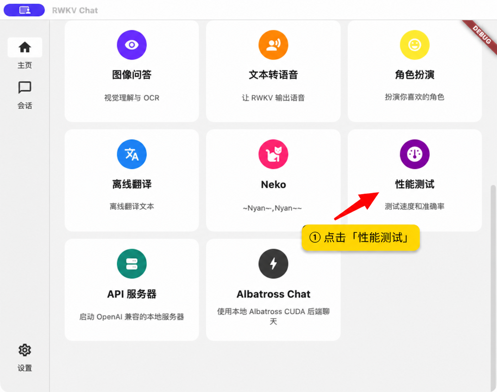
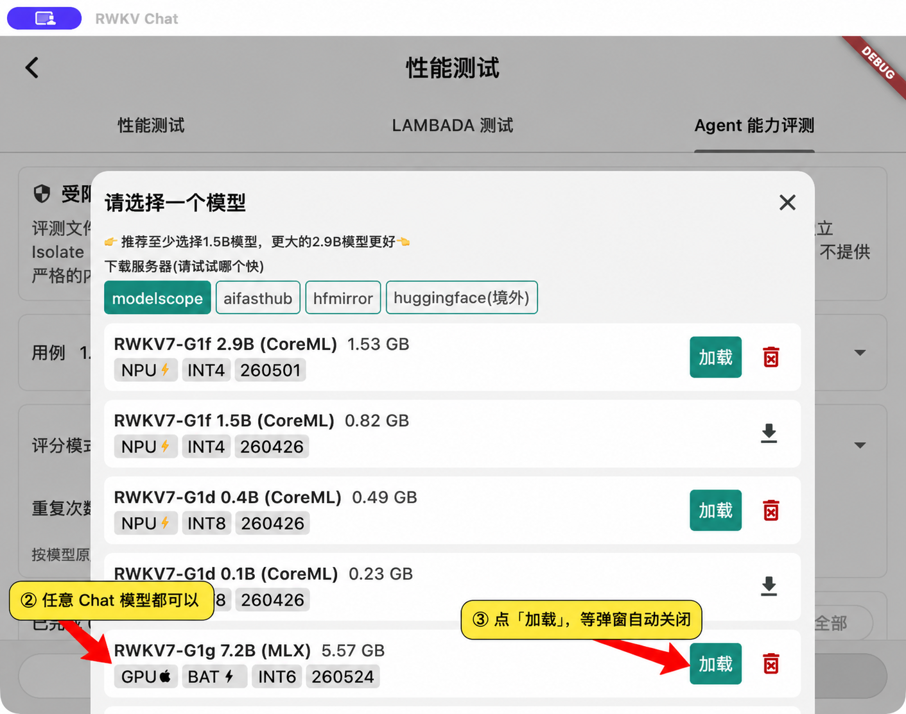
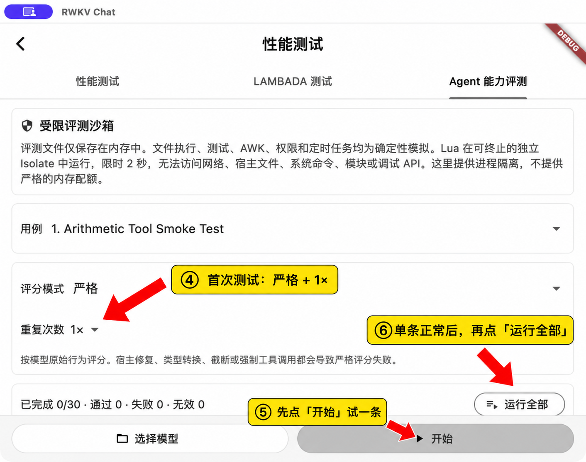
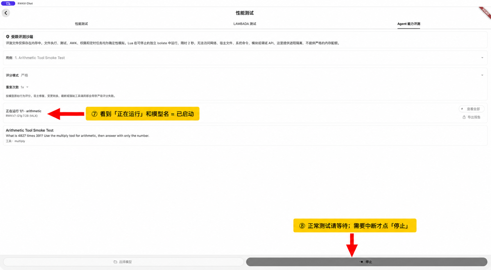

# Agentic Evaluation

This directory defines the reproducible Agentic Evaluation v0.1 workflow used by RWKV App

## What v0.1 measures

Primitive Bench v0.1 contains 30 deterministic cases in four capability groups:

- Tool use and navigation
- Coding and verification
- Safety and truthfulness
- Long-context and data reasoning

The suite uses an in-memory tool host. It does not invoke Terminal, read host files, access the network, or execute arbitrary host programs. Restricted Lua runs in a killable Dart isolate with a two-second timeout. Isolate termination limits runaway execution, but does not enforce a hard memory quota

The source and capability grouping are recorded in `assets/agent_cases/primitive_bench_manifest.json`. Every report also records the SHA-256 of the exact case JSON

## Current Windows campaign

The current evaluation campaign runs on Windows and starts with individually reviewed cases before any broader batch

Phone-side Agentic testing is outside this campaign. A Windows report remains valid without a mobile run

Core evaluation behavior is implemented in the RWKV App repository. Adapter or native-engine work is required only when evidence identifies a defect below the App layer

## Scoring modes

Strict mode is the release-comparison score. It requires canonical tool-call JSON and treats any output repair, envelope normalization, argument coercion, output truncation, or forced tool call as a strict failure

Assisted mode is diagnostic. It allows the existing audited host repairs and reports both:

- Strict pass: the model completed the case without score-changing host assistance
- Assisted pass: the task succeeded after audited host assistance

Transport continuation and schema guidance are recorded but do not change strict scoring because they do not rewrite the model's output or arguments

Infrastructure failures are invalid runs. They are excluded from valid model scoring and stop a batch

## App workflow

1. On Windows, load any Chat model you want to evaluate
2. Open Performance Test, then Agent Evaluation
3. Select Strict mode
4. Select one repetition
5. Start one selected case and review its complete result
6. Continue with the next selected case
7. After individual review is stable, select one to three repetitions and run a broader batch
8. Export the JSON report

The App fixes the sampler to seed 42, temperature 0.2, top-k 500, top-p 0, zero presence/frequency penalties, and penalty decay 0.99. It validates this configuration before native generation and restores the previous sampler and seed after each case

The App verifies idle and stop state against the active chat model ID. It subscribes before generation, accepts response-buffer content only from Agent-owned polls for that model, ignores stale content retained from an earlier generation, and stops with a `first_token_timeout` infrastructure failure when no fresh output arrives within 20 seconds. Missing or mismatched backend responses are also infrastructure failures

Reports are updated after every completed case under the platform application-support directory and can be exported from the UI

The manifest records the exact selected case names and planned run count, so a completed single-case report is distinct from an interrupted full-suite report

The App never reads a model file to calculate or validate SHA-256. It starts report setup without full-file hashing. If model metadata already contains a hash, the report copies it as unverified metadata and records `sha256Verified: false`

## Human quick test

The first manual check should run one case with Strict mode and one repetition. This confirms that model loading, the Start button, generation, tool handling, scoring, and report state all work before starting the full 30-case suite

1. On Home, scroll down and open Performance Test



2. Open the Agent Evaluation tab, choose any Chat model, click Load, and wait for the model dialog to close



3. Keep Strict mode and 1× for the first check. Click Start to run the selected case. After the single case works, click Run All to run the complete suite



4. A real run shows the running case and model name, and the bottom action changes to Stop. Wait for the result unless you intentionally need to cancel



The selected model does not need to be G1h or a specific quantization. An older or weaker model is still a valid evaluation target; its limitations should appear as failed cases in the report

Manually stopping a run produces an invalid cancelled result. It is counted under `INVALID`, excluded from `PASS` and `FAIL`, and does not produce task-specific capability failures from incomplete work

## Reference BF16 or FP16 workflow

Use an OpenAI-compatible reference endpoint that serves the unquantized model:

```bash
dart run tools/agent_eval_reference.dart \
  --endpoint http://HOST:PORT/v1/completions \
  --model RWKV7-G1h \
  --precision bf16 \
  --source-revision GIT_REVISION \
  --repeats 3 \
  --output reports/g1h-bf16.json
```

Use `--protocol chat` only when the server exposes chat completions and preserves the supplied G1h prompt. Use `--api-key-env NAME` to read credentials from the environment. `--model-sha256` may copy an operator supplied value into report metadata, but the runner never validates it and never requires it

The reference runner imports the same protocol, runtime, sandbox, 30 cases, and scoring code as the App. It writes a partial report after each case and stops on infrastructure failure

## Compare reports

```bash
dart run tools/agent_eval_report.dart \
  reports/g1h-bf16.json \
  reports/g1h-q4-macos.json \
  --format markdown \
  --output reports/comparison.md
```

The comparison includes strict and assisted pass counts, invalid runs, per-case outcomes, failure taxonomy, and host-intervention counts. CSV and JSON summaries are also supported

## CTO delivery gate

A model revision is ready for a decision-quality handoff when the package contains:

- One BF16 or FP16 reference report with three complete repetitions and exact declared model identity
- One target-device report per supported quantization/backend combination
- The generated comparison report
- Zero invalid runs in the compared set
- A short failure review identifying model failures, host interventions, and regressions by capability group
- Exact app version, source revision, benchmark hash, declared model identity, model-hash verification status, device, backend, sampler, and run IDs

If the model is still changing, deliver the same package as an exploration snapshot. Label it with the exact declared model identity and source revision and avoid presenting it as a final capability claim
